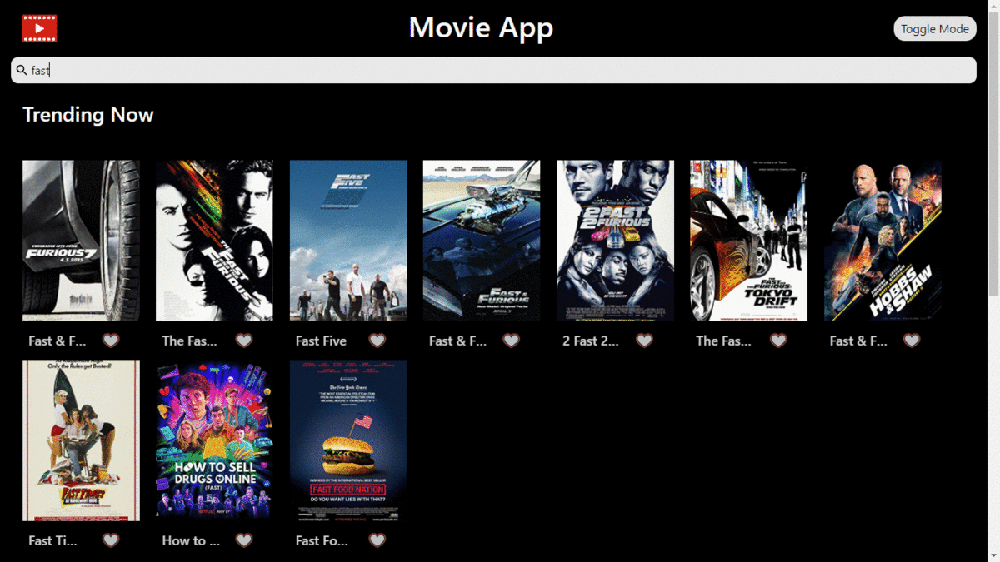

# Movie Listing App

A simple web app made with react that uses OMDb API to display Movie

Made by VIVEk NAGAR

## Live URL


```http
  https://movieappbyvivek.web.app/
```


## Screenshots



 ### Libraries used
`styled-components`
`axios`
`react-scripts`

### APIs Used
[The Open Movie Database APIs](http://www.omdbapi.com/)

Generate API key from : http://www.omdbapi.com/apikey.aspx

### API Info
* Method: `GET`
* Search URL: `https://www.omdbapi.com/?s={MOVIE_NAME}&apikey={API_KEY}`
* Movie Details URL: `https://www.omdbapi.com/?i={MOVIE_ID}&apikey={API_KEY}`

## Features

* Seach movie in database
* see full details of a movie
* add/remove movies to favorite
* Light/Dark Mode
* Cross platform 
